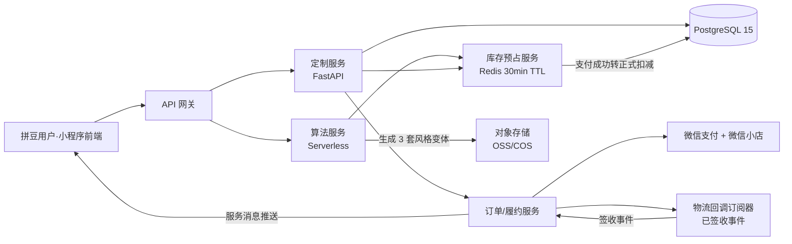

# 系统架构 · 拼豆小程序 v0.5

```yaml
文档名: System Architecture - 拼豆小程序
版本: v0.5（C4-L2 + 库存预占 + 履约订阅）
最后更新: 2026-05-17
关联文档: 01-prd.md, 05-data-model.md, 06-api-spec.md, 07-algo-spec.md
关联 ADR: ADR-002, ADR-003, ADR-011, ADR-019, ADR-021, ADR-023, ADR-026
```

---

## 1. 架构总览

### 1.1 一句话定位
> **多端小程序前端 + Serverless 算法引擎 + 关系型业务库 + 对象存储**的轻量化云原生架构

### 1.2 整体架构图（C4 - L1 系统上下文）

```
                     ┌──────────────────────┐
                     │       用户            │
                     │ （C 端 / 创作者 / B端）│
                     └────────┬─────────────┘
                              │
              ┌───────────────┼───────────────┐
              ▼               ▼               ▼
     ┌────────────────┐ ┌────────────┐ ┌──────────────┐
     │  微信小程序     │ │ 抖音小程序  │ │  B 端 PC 后台 │
     │  (uni-app)     │ │ (uni-app)  │ │  (Phase 2+)  │
     └────────┬───────┘ └─────┬──────┘ └──────┬───────┘
              │               │                │
              └───────────────┼────────────────┘
                              │
                              ▼
                ┌────────────────────────┐
                │   API Gateway          │
                │ （腾讯 / 阿里 / 微信云） │
                └────────────┬───────────┘
                             │
        ┌────────────────────┼────────────────────┐
        ▼                    ▼                    ▼
  ┌──────────┐        ┌─────────────┐      ┌────────────┐
  │ 业务服务  │        │ 算法服务    │      │ 异步任务队列│
  │ FastAPI  │        │ Serverless  │      │ Celery/RQ  │
  └────┬─────┘        └──────┬──────┘      └─────┬──────┘
       │                     │                   │
       ▼                     ▼                   ▼
  ┌─────────┐          ┌──────────┐         ┌────────┐
  │ Postgres│          │   OSS    │         │ Redis  │
  │ + Redis │          │（图片/图纸）│       │（缓存/队列）│
  └─────────┘          └──────────┘         └────────┘
       │
       │ 业务事件
       ▼
  ┌──────────────┐    ┌──────────────┐
  │ 供应链 API    │    │ 数据中台      │
  │（Mard / 优肯）│    │（埋点/BI）    │
  └──────────────┘    └──────────────┘
```

### 1.3 C4-L2 容器图（Mermaid）

> 在 §1.2 系统上下文之上展开容器层视图，明确 MVP 阶段每个容器的职责边界。



> 关联 ADR-019（风格变体分支）/ ADR-023（库存预占）/ ADR-026（履约签收事件订阅）。

---

## 2. 核心组件说明

### 2.1 前端层

| 组件 | 技术 | 部署 | 说明 |
|---|---|---|---|
| 微信小程序 | uni-app + Vue3 + NutUI | 微信公众平台 | 主战场 |
| 抖音小程序 | 同上（编译目标切换） | 抖音开放平台 | Phase 2 |
| B 端 SaaS（门店） | Vue3 + Element Plus | 静态站 + CDN | Phase 2 |
| H5 落地页 | Vue3 SSR / Nuxt3 | CDN | 营销活动用 |

### 2.2 网关层

- **MVP**：直接使用微信云开发（CloudBase）的内置网关，省运维（关联 ADR-002）
- **Phase 2 后**：迁移到独立 API Gateway（腾讯 API Gateway / Apisix），支持限流、鉴权、路由

### 2.3 业务服务层（FastAPI）

按领域划分微服务，但 MVP 阶段建议**单体部署，多模块组织**：

| 服务模块 | 职责 |
|---|---|
| `user-service` | 用户登录、信息、积分（PX） |
| `pattern-service` | 图纸 CRUD、风格变体切换（list / switch） |
| `order-service` | 订单创建、状态机、支付回调 |
| `inventory-service` | 色卡库存查询、可售性判断 |
| `creator-service` | 创作者认证、佣金（Phase 2） |
| `commerce-service` | 购物车、SKU、价格 |

> **建议**：MVP 用单体，Phase 3 GMV 起来后按需拆分。

### 2.4 算法服务层（核心）

| 子模块 | 输入 | 输出 | 部署方式 |
|---|---|---|---|
| 抠图（Cutout）| 原始图片 | 透明背景图片 | Serverless 云函数 |
| 像素化（Pixelize）| 图片 + 网格规格 + 难度 | 像素矩阵 + 颜色统计 | Serverless 云函数 |
| 色号映射（ColorMap）| 像素矩阵 + 品牌色卡 | 带色号的像素矩阵 | 业务服务内嵌 |
| 风格变体（StyleVariant Branch）| Quantize 输出 | 3 套变体图（写实 / 像素艺术 / 卡通）+ 默认变体标识 | Serverless 云函数（并行 3 任务） |
| 算料（Calculation）| 带色号矩阵 | SKU 列表 + 数量 | 业务服务内嵌 |
| LED 指令生成（IoT）| 像素矩阵 | BLE 数据帧序列 | Phase 3 启用 |

> **管线分支说明**：算法管线 §④ Quantize 完成后会**并行**分叉到「风格变体生成」管线（关联 §2.7 / ADR-019）；3 套变体输出预写入对象存储与 `patterns.pattern_data.style_variants`，用户切换时零延迟，不重算。
>
> 详见 [`./07-algo-spec.md`](./07-algo-spec.md)

### 2.5 库存预占模块（关联 ADR-023）

实现"永远买得到"承诺的后端兜底。MVP 用 Redis 即可，无需单独服务。

| 维度 | 实现 |
|---|---|
| 数据载体 | Redis Hash：`inv:reserve:<reservation_id>` + EXPIRE 1800（30 min TTL）|
| 触发时机 | 算法生成图纸成功 → BizSvc 调用 `POST /inventory/reserve` |
| 释放时机 | ① 支付成功 → 转正式扣减 Postgres `bead_skus.stock_qty` ② 30 min 超时 → Redis 自动过期 ③ 用户取消 → `POST /inventory/release` |
| 监控指标 | `ghost_reservation_rate`（预占未成交比例）/ `oversell_count`（同色号超额）|
| 幽灵库存补偿 | 每分钟扫描器对比 Redis ↔ Postgres，差异 > 阈值时写企业微信告警 |

> 关联接口：详见 06-api-spec.md §7.1 / §7.2。  
> 关联数据模型：详见 05-data-model.md `inventory_reservations` 表。

### 2.6 履约事件订阅（关联 ADR-026）

抓住"签收当天"情绪峰值，把履约状态变化转成主动触达。

| 维度 | 实现 |
|---|---|
| 输入 | 微信小店 / 自建履约系统的物流回调（关键状态：**已签收**） |
| 订阅器 | 独立 Serverless 云函数 `logistics-subscriber`，幂等消费 webhook |
| 输出动作 | ① 调用 `wx.sendSubscribeMessage` 推送服务消息「💝 拼豆到家啦~ 拼完记得来这里晒图」② 触发 M11 晒图引导小程序内页（订单详情页"我拼完啦"按钮亮起） |
| 兜底 | 48h 未推达 → 走短信回退（仍受微信公众平台频次限制）|
| 关联 PRD | M11 完成与分享 US-11.1（签收当天主动按钮） |

### 2.7 风格变体生成缓存管线（关联 ADR-019）

让"挑感觉而不是改色号"成为零延迟切换。

| 维度 | 实现 |
|---|---|
| 触发时机 | 算法 8 步管线 §④ Quantize 完成后并行触发 3 个变体任务（详见 07-algo-spec.md §1.2）|
| 变体类型 | 写实（默认）/ 像素艺术 / 卡通 共 3 套，每套独立的色彩风格管线参数 |
| 存储 | 对象存储路径 `patterns/{id}/variants/{style}.png`；元数据写入 `patterns.pattern_data.style_variants` 子键（详见 05-data-model.md）|
| 用户切换 | 前端调 `POST /patterns/{id}/style-variants` 的 list / switch 双 action，零延迟（不重算）|
| 缓存策略 | 与原图共享同一 `pattern_id` 前缀，对象存储天然 CDN 友好 |

### 2.8 数据存储层

| 存储 | 用途 | 选型 |
|---|---|---|
| 关系数据库 | 用户、订单、图纸元数据、色卡 | PostgreSQL（云托管）|
| 缓存 | 热点色卡、Session、限流计数、库存预占 | Redis（云托管）|
| 对象存储 | 用户上传图片、生成图纸图、风格变体图、成品照 | OSS / COS |
| 消息队列 | 异步图像处理、订单事件、履约回调 | Redis Queue（MVP）→ RabbitMQ（Phase 3）|
| 数据仓库 | 埋点事件、BI 分析 | ClickHouse（Phase 2）|

### 2.9 第三方依赖

| 依赖 | 用途 | 风险等级 |
|---|---|---|
| 微信支付 / 字节支付 | 支付链路 | 🔴 关键 |
| 微信开放平台（登录/订阅消息）| 鉴权 / 通知 | 🔴 关键 |
| 微信小店 OpenAPI | 标品 + 送礼物订单（关联 §10）| 🔴 关键 |
| 物流回调 webhook（微信小店 / 自建履约）| 履约「已签收」事件订阅（关联 §2.6）| 🟠 高 |
| Mard 色卡 API | 库存约束 | 🟠 高 |
| 内容安全 API（腾讯云天御）| 图片审核 | 🟠 高（Phase 3）|
| 快递 100 / 菜鸟 | 物流追踪 | 🟢 中 |

---

## 3. 关键数据流

### 3.1 核心链路：上传 → 图纸生成 → 下单

```
[1] 用户在小程序选择图片
        │
        ▼
[2] 小程序前端通过临时 URL 上传至 OSS
        │
        ▼
[3] OSS 触发事件 → 云函数（抠图）
        │
        ▼
[4] 抠图结果 → 云函数（像素化 + 色彩量化）
        │
        ▼
[5] 业务服务调用 inventory-service 查询库存
        │
        ▼
[6] 缺货色号自动 CIE Lab 替换
        │
        ▼
[7] 返回完整图纸数据 + 算料清单（⛔ 用户侧不展示库存灯，仅运营后台用，关联 ADR-023）
        │
        ▼
[8] 用户确认 → 调用 commerce-service 加购
        │
        ▼
[9] 调用 order-service 创建订单
        │
        ▼
[10] 调用微信支付 → 异步回调 → 订单状态更新
        │
        ▼
[11] 推送配料单至供应链 API
        │
        ▼
[12] 仓库分拣 → 物流发货 → 用户收货
```

### 3.2 异步事件流（事件驱动核心）

| 事件 | 生产方 | 消费方 |
|---|---|---|
| `image.uploaded` | 前端 | 抠图云函数 |
| `cutout.completed` | 抠图云函数 | 像素化云函数 |
| `pattern.generated` | 像素化云函数 | 业务服务（写入 DB）+ 风格变体分支 |
| `inventory.reserved` | 业务服务 | 监控（ghost_reservation_rate）|
| `order.paid` | 支付回调 | 配料单服务 + 库存正式扣减 |
| `order.shipped` | 供应链 API | 订阅消息推送服务 |
| `order.delivered`（已签收）| 物流回调订阅器 | M11 晒图引导 + 服务消息推送 |

---

## 4. 部署架构

### 4.1 环境矩阵

| 环境 | 用途 | 域名 | 数据 |
|---|---|---|---|
| dev | 本地开发 | localhost | 模拟数据 |
| test | 测试 | test-api.pindou.com | 完整测试集 |
| staging | 预发布 | stage-api.pindou.com | 生产数据快照 |
| prod | 生产 | api.pindou.com | 真实数据 |

### 4.2 Serverless vs 容器混合部署

| 服务 | 部署方式 | 理由 |
|---|---|---|
| 业务服务（FastAPI）| 容器（K8s 或云托管）| 长连接、稳定性 |
| 算法服务 | Serverless 云函数 | 突发流量、按用计费（关联 ADR-002）|
| 异步任务 | Serverless 云函数 | 同上 |
| 静态资源 | CDN | 加速 + 省钱 |

### 4.3 CI/CD 流水线（高层）

```
代码提交 → GitHub Actions
  ├── 单元测试
  ├── Lint / 类型检查
  ├── 构建镜像 / 编译小程序
  └── 部署
        ├── PR → test 环境
        ├── main → staging 环境
        └── tag (v*.*.*) → prod 环境（需人工审批）
```

---

## 5. 安全架构

### 5.1 鉴权体系

| 端 | 鉴权方式 |
|---|---|
| 微信小程序 | wx.login → 后端换 openid + 自定义 JWT |
| 抖音小程序 | 同上（字节侧 API）|
| B 端 SaaS | 账号密码 + JWT + 角色权限 RBAC |
| 内部服务调用 | 服务间 mTLS（Phase 3）|

### 5.2 数据安全

- 用户上传图片：OSS 临时签名 URL，**24 小时后自动删除**
- 用户隐私数据：身份证/手机号加密存储（AES-256）
- 数据库连接：SSL/TLS 强制
- 备份：每日全量 + 实时 binlog 增量

### 5.3 风控

- 接口限流（Redis + 令牌桶）
- 图片内容安全审核（Phase 3 接入腾讯天御）
- 异常订单识别（同一 IP/设备短时间高频下单）

---

## 6. 可扩展性设计

### 6.1 当前规模假设（MVP）

- 注册用户：≤ 10,000
- 月订单：≤ 5,000
- 算法 QPS 峰值：≤ 50

### 6.2 水平扩展路径

| 维度 | 触发条件 | 扩展方案 |
|---|---|---|
| 业务服务 | QPS > 200 | K8s HPA 自动扩容 |
| 算法服务 | 算法耗时 P95 > 10s | Serverless 自动 + 算法降级 |
| 数据库 | 写入 > 1k QPS | 读写分离 + 分库分表 |
| 对象存储 | — | OSS 天然横向扩展 |

### 6.3 技术债清单（已知未来要还）

- [ ] MVP 单体架构后续需拆分微服务（GMV > 100 万/月触发）
- [ ] Redis Queue 后续替换为 RabbitMQ/Kafka
- [ ] 业务服务后续引入服务网格（Istio）

---

## 7. 监控与可观测性（详见 `17-monitoring.md`）

### 7.1 三大支柱

| 类别 | 工具 | 关键指标 |
|---|---|---|
| Metrics | Prometheus + Grafana | QPS、延迟、错误率 |
| Logs | ELK / Loki | 结构化日志 |
| Traces | Jaeger（Phase 3）| 链路追踪 |

### 7.2 关键告警

| 告警项 | 阈值 | 通知 |
|---|---|---|
| 算法 P95 耗时 | > 15s | 企业微信 + 短信 |
| 支付失败率 | > 5% | 立即通知 |
| 5xx 错误率 | > 1% | 企业微信 |
| 数据库 CPU | > 80% | 企业微信 |
| 库存幽灵预占率 | > 5% | 企业微信（关联 §2.5） |
| 履约签收推送送达率 | < 90% | 企业微信（关联 §2.6） |

---

## 8. 多端架构差异（关联 `08-miniapp-spec.md`）

| 维度 | 微信小程序 | 抖音小程序 | B 端 PC |
|---|---|---|---|
| 鉴权 | wx.login | tt.login | 账号密码 |
| 支付 | 微信支付 | 字节支付 | 微信支付 + 对公转账 |
| 推送 | 订阅消息 | 抖音订阅消息 | Email + 站内信 |
| 上传 | wx.chooseImage | tt.chooseImage | 浏览器 input |
| 包大小限制 | 主包 2MB / 总包 20MB | 主包 4MB / 总包 16MB | 无限制 |

---

## 9. Phase 2 占位（向前兼容，MVP 不启用）

> 以下模块在 MVP 不启用，Phase 2 启用，当前文档保留容器轮廓与上下游接口约定。

### 9.1 PX 积分服务

> 🅿️ Phase 2 占位  
> PX 积分服务在 MVP 不启用，Phase 2 与 UGC 社区一起做。当前 `px_ledger` 表保留 schema，后端不写入。  
> 关联 ADR：ADR-018, ADR-007

### 9.2 UGC 社区服务

> 🅿️ Phase 2 占位  
> UGC 社区在 MVP 不启用，Phase 2 启用。当前文档保留容器抽象，未来按内容审核 + 创作者激励单独立 PRD。  
> 关联 ADR：ADR-009

### 9.3 代拼撮合服务

> 🅿️ Phase 2 占位  
> 代拼撮合在 MVP 不启用，Phase 2 启用。  
> 关联 ADR：ADR-010, ADR-016

### 9.4 智能拼豆板（IoT）

> 🅿️ Phase 2 占位  
> 智能拼豆板在 MVP 不启用，Phase 3+ 启用。当前文档保留 BLE 协议接口位。  
> 关联 ADR：ADR-005

---

## 10. 微信小店联动架构（关联 ADR-011）

> Phase 1 末（W7~8）启用。混合架构：定制核心留小程序，标品 + 送礼物挂微信小店。

### 10.1 全域流量入口

```
┌─────────────────────────────────────────────────────────┐
│              微信生态全域流量                             │
│   视频号 / 公众号 / 朋友圈 / 搜一搜 / 看一看 / 群聊         │
└──────┬──────────────────┬───────────────────────┬───────┘
       │                  │                        │
       ▼                  ▼                        ▼
┌────────────┐    ┌──────────────┐         ┌──────────────┐
│ 微信小店    │    │ 小红书种草   │         │ 用户分享卡片  │
│ (商品挂载)  │    │ (KOL 内容)   │         │ (US-11.2)    │
└─────┬──────┘    └──────┬───────┘         └──────┬───────┘
      │                  │                         │
      │ 「送礼物」入口    │ CTA「点击定制」          │ 「拼好啦」转发
      │                  ▼                         ▼
      │        ┌──────────────────────────────────────────┐
      └───────►│  拼豆小程序 (定制创作核心 - 不可替代)      │
               │  ✅ 上传照片 → 抠图 → 算法生成图纸          │
               │  ✅ 库存约束 + 智能算料 + 实物尺寸预览      │
               │  ✅ 一键加购 → C2M 定制订单 (动态 SKU)      │
               │  ✅ 支付完成 → 配料单推送供应链            │
               └──────────┬───────────────────────────────┘
                          │
                          │ 完成订单后, 标品 + 送礼挂到小店
                          ▼
               ┌──────────────────────────────┐
               │ 微信小店 (标品 + 送礼)        │
               │ ✅ 拼豆底板 / 工具包 / 礼盒    │
               │ ✅ 已有图纸成品 (Phase 2)     │
               │ ✅ 「送礼物」功能 (核心场景)    │
               │ ✅ 节日限定礼盒 (春节/七夕)    │
               └──────────────────────────────┘
```

### 10.2 数据互通模型

| 数据 | 主存储 | 同步方向 | 用途 |
|---|---|---|---|
| 用户身份（unionid）| 小程序 + 小店共享 | 双向 | OAuth 联合登录 |
| 定制图纸数据 | 小程序后端 PostgreSQL | 小程序 → 小店（生成礼物订单时）| 礼物展示 |
| 标品 SKU 库存 | 微信小店托管 | 小店 → 小程序（查询）| 标品下单 |
| 礼物订单 | 微信小店托管 | 小店 → 小程序（webhook 推送）| 配料单生成 |
| 物流信息 | 微信小店托管 | 单向 | 用户查询 |
| 支付分账 | 微信支付 | 双向 | 财务对账 |

### 10.3 关键技术接入点

| 模块 | 接入方式 | 备注 |
|---|---|---|
| 微信小店商品 SDK | 小程序内嵌 `<官方组件>` | 商品卡片 / 跳转支付 |
| 礼物订单 API | 后端调用微信小店 OpenAPI | 创建礼物订单 / 生成礼物链接 |
| 礼物订单 Webhook | 接收小店推送 | 收礼方填地址后触发配料单 |
| OAuth 联合登录 | unionid 互通 | 同一微信用户跨小程序/小店身份一致 |
| 深链跳转 | `wx.openEmbeddedMiniProgram` 或 H5 中转 | 小店 ↔ 小程序双向互跳 |

### 10.4 风险与降级

| 风险 | 严重度 | 应对 |
|---|---|---|
| 微信小店审核类目卡 C2M 定制 | 🔴 高 | 用"DIY 工具/材料包"类目过审，定制文案弱化 |
| 小店送礼物 API 限流 | 🟡 中 | 失败重试 + 用户兜底跳转客服 |
| unionid 不互通（如分小程序）| 🔴 高 | 必须确认所有小程序/小店都注册在同一开放平台账号下 |
| 抽成 1~5% 影响毛利 | 🟡 中 | 标品定价时预留 5% 兜底 |

### 10.5 灰度策略（W7~8）

```
Day 1~3:  仅自己 + 5 内测用户测送礼物全流程
Day 4~7:  扩大到 100 内测用户
Day 8~14: KOL 灰度（5 位小红书 KOL 试用送礼物功能）
Day 15+:  全量开放
```

每个阶段必过点：
- 礼物链接生成成功率 ≥ 99%
- 收礼方领取成功率 ≥ 95%
- 配料单按时推送成功率 ≥ 99%

---

## 11. 待补完成项

- [ ] C4 - L3 组件图（关键服务内部组件粒度）
- [ ] 完整时序图（核心链路）
- [ ] 灾备 / 容灾方案
- [ ] 与 IoT 智能板的通信架构（Phase 3 详化）
- [ ] 数据中台架构（Phase 3 详化）

---

## 12. 灵魂三句话锚点

> 拼豆产品灵魂三句话（关联 ADR-013）：
> 1. 零智商税
> 2. 把感情做成礼物
> 3. 在心流中找回自我
>
> 本文档关键架构决策与三句话的对应关系如下，逐条接受未来重大改动的"反查"。

| # | 设计 / 决策点 | 对应灵魂 | 一句话理由（≤ 40 字） |
|---|---|---|---|
| 1 | 库存预占 30 分钟 TTL（§2.5） | 零智商税 | 用户不必为缺货焦虑，下单即承诺 |
| 2 | 履约「已签收」事件主动推送（§2.6） | 把感情做成礼物 | 抓情绪峰值，让收货当天就分享 |
| 3 | 风格变体预生成缓存（§2.7） | 在心流中找回自我 | 用户挑感觉而非改色号，不被打断 |
| 4 | C4-L2 显式画出库存预占容器 | 零智商税 | 把承诺落到容器图，不留口头空头 |

---

## 13. 变更日志

| 日期 | 版本 | 变更 | 备注 |
|---|---|---|---|
| 2026-05-17 | v0.1 | 初始化骨架，绘制 L1 上下文图 | 项目组 |
| 2026-05-17 | v0.5 | 新增 C4-L2 Mermaid 容器图 + 库存预占模块（Redis 30min TTL）+ 履约「已签收」事件订阅 + 风格变体生成缓存管线 + 整合 Phase 2 占位 + 灵魂三句话锚点 | 关联 ADR-019, ADR-023, ADR-026 |
