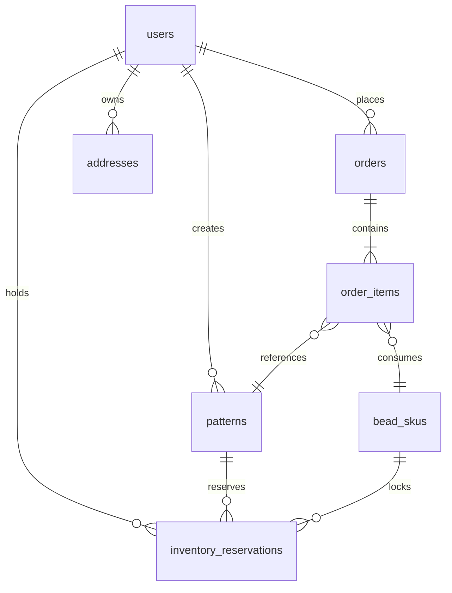

# 数据模型 · 拼豆小程序 v0.5

```yaml
文档名: Data Model - 拼豆小程序
版本: v0.5（库存表 + 首单字段 + 风格变体）
最后更新: 2026-05-17
关联文档: 04-system-architecture.md, 06-api-spec.md, 07-algo-spec.md
关联 ADR: ADR-007, ADR-017, ADR-018, ADR-019, ADR-020, ADR-023
```

---

## 0. 数据库选型

| 类别 | 选型 | 用途 |
|---|---|---|
| 主库 | PostgreSQL 15 | 事务型业务数据 |
| 缓存 | Redis 7 | 热点数据、会话、限流、库存预占 |
| 对象存储 | OSS / COS | 图片、图纸文件 |
| 数据仓库 | ClickHouse（Phase 3）| 埋点、BI |

---

## 1. 数据模型总览（ER 图）

### 1.1 ER 图（ASCII，快速概览）

```
                ┌──────────────┐
                │    users     │
                └──┬───┬───┬───┘
                   │   │   │
       ┌───────────┘   │   └────────────┐
       ▼               ▼                ▼
  ┌─────────┐    ┌──────────┐     ┌──────────┐
  │ patterns│    │  orders  │     │ px_ledger│
  └────┬────┘    └─────┬────┘     └──────────┘
       │               │
       │               ▼
       │         ┌──────────────┐
       │         │ order_items  │
       │         └──────┬───────┘
       │                │
       └────┐           ▼
            ▼     ┌────────────┐
        ┌─────────┤  bead_skus │
        │colors   └────────────┘
        └─────────┘
```

### 1.2 Mermaid ER 图（机器友好）



> v0.5 起以本图作为机器可读基线；ASCII 版仅作快速概览。新表 `inventory_reservations`（关联 ADR-023）通过 `pattern_id` / `user_id` / `bead_skus` 三向连接，承担「下单即锁 30 分钟」承诺。

---

## 2. 核心表 DDL（v0.5）

> ⚠️ 所有 DDL 应同步到迁移工具（推荐 Alembic / Prisma Migrate）。

### 2.1 用户表 `users`

```sql
CREATE TABLE users (
    id              BIGSERIAL PRIMARY KEY,
    openid          VARCHAR(64)  UNIQUE NOT NULL,    -- 微信 openid
    unionid         VARCHAR(64),                     -- 微信 unionid（跨小程序识别）
    tt_openid       VARCHAR(64),                     -- 抖音 openid（Phase 2）
    nickname        VARCHAR(64),
    avatar_url      TEXT,
    phone           VARCHAR(20),                     -- 加密存储
    px_balance      INTEGER      DEFAULT 0,          -- PX 积分余额（关联 ADR-007；MVP 不写入，见 §2.8）
    level           SMALLINT     DEFAULT 1,          -- 用户等级 1~5
    total_xp        INTEGER      DEFAULT 0,
    invited_by      BIGINT       REFERENCES users(id),
    status          SMALLINT     DEFAULT 1,          -- 1=正常 0=封禁
    first_paid_at   TIMESTAMPTZ  NULL,                -- 首单支付完成时间（关联 ADR-020 首单大礼包判断 / ADR-018 老朋友 9 折判断）
    safety_card_delivered_at TIMESTAMPTZ NULL,        -- 包裹安全卡寄达时间（关联 ADR-017 履约关怀，仅运营追踪）
    created_at      TIMESTAMPTZ  DEFAULT NOW(),
    updated_at      TIMESTAMPTZ  DEFAULT NOW()
);
CREATE INDEX idx_users_openid ON users(openid);
CREATE INDEX idx_users_unionid ON users(unionid);
```

> ⛔ `users.safety_acknowledged_at`（付款前勾选签名时间）— v0.5 起废弃  
> 取代方案：`users.safety_card_delivered_at`（包裹安全卡寄达，仅运营追踪）  
> 关联 ADR：ADR-017

---

### 2.2 图纸表 `patterns`

```sql
CREATE TABLE patterns (
    id              BIGSERIAL PRIMARY KEY,
    user_id         BIGINT       NOT NULL REFERENCES users(id),
    name            VARCHAR(128),
    source_image_url TEXT        NOT NULL,           -- 原始图片 OSS URL
    cutout_image_url TEXT,                           -- 抠图后图片 URL
    preview_image_url TEXT,                          -- 像素预览图 URL
    grid_size       VARCHAR(16)  NOT NULL,           -- '32x32' / '48x48'
    difficulty      VARCHAR(16)  NOT NULL,           -- 'easy' / 'normal' / 'pro'
    color_count     SMALLINT     NOT NULL,           -- 实际使用色数
    pattern_data    JSONB        NOT NULL,           -- 像素矩阵 + 色号汇总 + 风格变体（见下例）
    color_summary   JSONB        NOT NULL,           -- {color_id: count, ...}（也镜像在 pattern_data 内）
    physical_size_cm NUMERIC(5,1),                   -- 实物尺寸（cm）
    algo_version    VARCHAR(16)  NOT NULL,           -- 算法版本号（关联回归测试）
    is_public       BOOLEAN      DEFAULT FALSE,      -- Phase 2 UGC 用
    created_at      TIMESTAMPTZ  DEFAULT NOW()
);
CREATE INDEX idx_patterns_user_id ON patterns(user_id);
CREATE INDEX idx_patterns_created_at ON patterns(created_at DESC);
```

**JSONB 示例**（v0.5 新增 `style_variants` 子键，关联 ADR-019）：
```json
{
  "pattern_data": [[1,1,2,3], [1,2,2,3], ...],
  "color_summary": {"1": 450, "2": 120, "3": 88},
  "style_variants": [
    {"style": "realistic", "preview_url": "patterns/9876/variants/realistic.png", "is_default": true},
    {"style": "pixel",     "preview_url": "patterns/9876/variants/pixel.png",     "is_default": false},
    {"style": "cartoon",   "preview_url": "patterns/9876/variants/cartoon.png",   "is_default": false}
  ]
}
```

**实现选项（关联 ADR-019）**：

- **选项 A：单字段内嵌 3 套（⭐ 推荐）**
  - `pattern_data.style_variants` 直接放在 `patterns.pattern_data` JSONB 里
  - 优点：单表一次取齐，与 ORM 兼容；变体最多 3 个，JSON 体积可控
  - 缺点：变体级单点更新需重写整个 JSON
- **选项 B：抽出独立表 `pattern_style_variants`**
  - 优点：变体可独立修改 / 扩展（未来 > 3 套）
  - 缺点：MVP 提早引入额外表，迁移与 join 成本变高

**结论**：MVP 选 A；等到 Phase 2 风格变体数 > 3 时再迁到 B（届时立 ADR 记录变更）。

---

### 2.3 色卡表 `colors`

```sql
CREATE TABLE colors (
    id              SERIAL PRIMARY KEY,
    brand           VARCHAR(32)  NOT NULL,           -- 'mard' / 'artkal' / 'perler'
    code            VARCHAR(32)  NOT NULL,           -- 品牌色号 'M-023'
    name            VARCHAR(64),                     -- '玫瑰红'
    hex             CHAR(7)      NOT NULL,           -- '#FF6B9D'
    rgb_r           SMALLINT     NOT NULL,
    rgb_g           SMALLINT     NOT NULL,
    rgb_b           SMALLINT     NOT NULL,
    lab_l           NUMERIC(6,3),                    -- CIE Lab 值
    lab_a           NUMERIC(6,3),
    lab_b           NUMERIC(6,3),
    is_active       BOOLEAN      DEFAULT TRUE,       -- 是否启用
    is_rare         BOOLEAN      DEFAULT FALSE,      -- 是否为稀有色（积分兑换专属）
    sku_id          BIGINT       REFERENCES bead_skus(id),
    UNIQUE (brand, code)
);
CREATE INDEX idx_colors_brand_active ON colors(brand, is_active);
```

---

### 2.4 库存/SKU 表 `bead_skus`

```sql
CREATE TABLE bead_skus (
    id              BIGSERIAL PRIMARY KEY,
    color_id        INTEGER      NOT NULL REFERENCES colors(id),
    pack_size       INTEGER      NOT NULL,           -- 每包颗数（如 500）
    price_cents     INTEGER      NOT NULL,           -- 单价（分）
    stock_qty       INTEGER      DEFAULT 0,          -- 当前库存（颗）
    stock_status    VARCHAR(16)  DEFAULT 'available',-- 'available' / 'low' / 'oos'
    low_threshold   INTEGER      DEFAULT 5000,       -- 低库存阈值
    supplier        VARCHAR(64),                     -- 供应商名
    sgs_certified   BOOLEAN      DEFAULT FALSE,      -- SGS 认证（关联 22-safety-checklist.md）
    sgs_cert_url    TEXT,                            -- 证书图片 URL
    created_at      TIMESTAMPTZ  DEFAULT NOW(),
    updated_at      TIMESTAMPTZ  DEFAULT NOW()
);
CREATE INDEX idx_bead_skus_status ON bead_skus(stock_status);
```

---

### 2.5 订单表 `orders`

```sql
CREATE TABLE orders (
    id              BIGSERIAL PRIMARY KEY,
    order_no        VARCHAR(32)  UNIQUE NOT NULL,    -- 业务单号 'PD202605170001'
    user_id         BIGINT       NOT NULL REFERENCES users(id),
    pattern_id      BIGINT       REFERENCES patterns(id),
    
    -- 金额
    total_cents     INTEGER      NOT NULL,           -- 订单总额（分）
    pay_cents       INTEGER      NOT NULL,           -- 实付金额
    discount_cents  INTEGER      DEFAULT 0,
    
    -- 状态机
    status          VARCHAR(24)  NOT NULL,           
    -- 'pending_pay' / 'paid' / 'shipped' / 'delivered' / 'completed'
    -- 'cancelled'  / 'refunding' / 'refunded'
    
    -- 支付
    pay_method      VARCHAR(16),                     -- 'wechat' / 'tt'
    pay_tx_id       VARCHAR(64),                     -- 第三方支付流水号
    paid_at         TIMESTAMPTZ,
    
    -- 收货
    address_snapshot JSONB,                          -- 下单时地址快照
    shipping_no     VARCHAR(64),                     -- 物流单号
    shipped_at      TIMESTAMPTZ,
    delivered_at    TIMESTAMPTZ,
    
    -- 履约
    sorting_pushed_at TIMESTAMPTZ,                   -- 配料单推送供应链时间
    
    created_at      TIMESTAMPTZ  DEFAULT NOW(),
    updated_at      TIMESTAMPTZ  DEFAULT NOW()
);
CREATE INDEX idx_orders_user_id ON orders(user_id);
CREATE INDEX idx_orders_status ON orders(status);
CREATE INDEX idx_orders_created_at ON orders(created_at DESC);
```

> ⛔ `orders.safety_acknowledged`（付款前勾选标记）— v0.5 起业务字段废弃  
> 取代方案：与 06-api-spec.md `POST /orders` 同步移除该必填字段；履约关怀通过 `users.safety_card_delivered_at` 追踪  
> 关联 ADR：ADR-017

**订单状态机**：
```
pending_pay ──支付──► paid ──发货──► shipped ──签收──► delivered ──7天──► completed
     │                  │                                   │
     └──取消──► cancelled└──申请退款──► refunding ──► refunded
```

---

### 2.6 订单明细表 `order_items`

```sql
CREATE TABLE order_items (
    id              BIGSERIAL PRIMARY KEY,
    order_id        BIGINT       NOT NULL REFERENCES orders(id) ON DELETE CASCADE,
    sku_id          BIGINT       NOT NULL REFERENCES bead_skus(id),
    color_id        INTEGER      NOT NULL REFERENCES colors(id),
    quantity        INTEGER      NOT NULL,           -- 颗数
    pack_quantity   INTEGER      NOT NULL,           -- 包数
    unit_price_cents INTEGER     NOT NULL,
    subtotal_cents  INTEGER      NOT NULL
);
CREATE INDEX idx_order_items_order_id ON order_items(order_id);
```

---

### 2.7 库存预占表 `inventory_reservations` ⭐ 新增

> 关联 ADR-023：图纸生成时即在 Redis 预占 30 分钟库存。Redis 是热路径，本表用于持久化轨迹与对账。

```sql
CREATE TABLE inventory_reservations (
    id              BIGSERIAL PRIMARY KEY,
    pattern_id      BIGINT       NOT NULL REFERENCES patterns(id),
    user_id         BIGINT       NOT NULL REFERENCES users(id),
    sku_quantities  JSONB        NOT NULL,             -- {sku_id: qty} 预占清单
    reserved_at     TIMESTAMPTZ  NOT NULL DEFAULT NOW(),
    expires_at      TIMESTAMPTZ  NOT NULL,             -- reserved_at + 30 分钟
    status          VARCHAR(16)  NOT NULL DEFAULT 'active',
    -- 'active' / 'released' (用户取消 / 超时) / 'consumed' (支付成功转正式扣减)
    released_reason VARCHAR(32),                       -- user_cancel / ttl_expired / payment_failed
    released_at     TIMESTAMPTZ,
    consumed_at     TIMESTAMPTZ,
    created_at      TIMESTAMPTZ  DEFAULT NOW(),
    updated_at      TIMESTAMPTZ  DEFAULT NOW()
);

-- 扫描器轮询索引：每分钟检查 expires_at < NOW() 且 status='active' 的记录
CREATE INDEX idx_inv_res_expires ON inventory_reservations(expires_at) WHERE status='active';
CREATE INDEX idx_inv_res_user_id ON inventory_reservations(user_id);
CREATE INDEX idx_inv_res_pattern_id ON inventory_reservations(pattern_id);
```

**生命周期**：
1. 算法生成图纸成功 → `POST /inventory/reserve` → 写入 `status='active'` + Redis EXPIRE 1800
2. 支付成功 → `status='consumed'` + 从 Postgres `bead_skus.stock_qty` 扣减
3. 用户取消 / 30 min 超时 / 支付失败 → `status='released'` + `released_reason` 记录原因

**对账**：每分钟扫描器对比 Redis Hash ↔ 本表 `status='active'`，差异写企业微信告警（关联 04-system-architecture.md §2.5）。

---

### 2.8 PX 积分流水 `px_ledger`

> ⚠️ **MVP 不启用，Phase 2 启用**（关联 ADR-018 / ADR-007）  
> Schema 保留但 MVP 阶段后端不写入；老用户复购钩走 `users.first_paid_at` + 实体「下次免运费」券，不发放 PX。  
> 当 Phase 2 UGC 社区上线时再按 ADR-007 启动 PX 体系。

```sql
CREATE TABLE px_ledger (
    id              BIGSERIAL PRIMARY KEY,
    user_id         BIGINT       NOT NULL REFERENCES users(id),
    delta           INTEGER      NOT NULL,           -- 正=获得，负=消耗
    balance_after   INTEGER      NOT NULL,           -- 变动后余额（核对用）
    
    source_type     VARCHAR(32)  NOT NULL,           
    -- 'order_paid' / 'daily_login' / 'invite' / 'redeem' / 'admin_adjust'
    source_id       VARCHAR(64),                     -- 关联订单/活动 ID
    
    description     TEXT,
    expire_at       TIMESTAMPTZ,                     -- 部分活动 PX 有过期时间
    created_at      TIMESTAMPTZ  DEFAULT NOW()
);
CREATE INDEX idx_px_ledger_user ON px_ledger(user_id, created_at DESC);
```

---

## 3. Phase 2+ 扩展表（预留设计）

> 🅿️ Phase 2 占位  
> 下表所有扩展表在 MVP 不启用，Phase 2+ 按需启用。当前数据模型仅保留命名约定与启用时机，避免 v0.5 schema 提前膨胀。  
> 关联 ADR：ADR-009 (UGC 社区), ADR-010/016 (代拼撮合), ADR-005 (智能拼豆板)

| 表名 | 用途 | 何时启用 |
|---|---|---|
| `creators` | 创作者档案 | Phase 2 |
| `creator_earnings` | 佣金流水 | Phase 2 |
| `pattern_likes` / `pattern_comments` | 社区互动 | Phase 2 |
| `merchants` | B 端门店 | Phase 2 |
| `proxy_orders` | 代拼撮合 | Phase 1 末加分项 / Phase 2 |
| `iot_devices` | 智能板设备绑定 | Phase 3 |
| `badges` / `user_badges` | 徽章系统 | Phase 1 |

---

## 4. Redis Key 规范

### 4.1 命名规范
```
<业务域>:<对象>:<id>[:<子键>]

例：
user:profile:12345
order:status:PD202605170001
algo:queue:pending
ratelimit:upload:openid_xxx
sku:stock:42
inv:reserve:<pattern_id>
```

### 4.2 关键缓存

| Key | TTL | 用途 |
|---|---|---|
| `user:session:<openid>` | 7d | 登录态 |
| `sku:stock:<sku_id>` | 60s | 库存热点缓存 |
| `colors:active:<brand>` | 1h | 启用色卡列表 |
| `algo:result:<task_id>` | 24h | 算法异步任务结果 |
| `ratelimit:upload:<user>` | 1m | 上传频率限制 |
| `inv:reserve:<pattern_id>` | 30m | 库存预占（关联 ADR-023 / §2.7） |

---

## 5. OSS 目录结构

```
oss-bucket/
├── uploads/                          # 用户原图（24h 自动删除）
│   └── <yyyy-mm-dd>/<openid>/<uuid>.jpg
├── cutouts/                          # 抠图结果（30d 保留）
│   └── <yyyy-mm-dd>/<pattern_id>.png
├── patterns/                         # 像素图纸预览（永久）
│   ├── <pattern_id>.png
│   └── <pattern_id>/variants/        # 风格变体（关联 ADR-019）
│       ├── realistic.png
│       ├── pixel.png
│       └── cartoon.png
├── creators/                         # 创作者上传图纸（Phase 2）
└── certs/                            # SGS 证书图片
```

---

## 6. 数据安全与合规

| 数据类别 | 处理方式 |
|---|---|
| 用户原图 | 24 小时后自动删除（隐私要求） |
| 手机号 | AES-256 加密存储，展示时脱敏 |
| 微信 openid | 脱敏不可外露 |
| 支付流水 | 不存储完整卡号；仅留第三方流水号 |
| 数据库连接 | 强制 SSL/TLS |
| 备份 | 每日全量 + binlog 增量；保留 30 天 |

---

## 7. 数据库性能预留

| 对象 | MVP 估算 | Phase 3 估算 |
|---|---|---|
| `users` 行数 | 10K | 1M |
| `patterns` 行数 | 50K | 10M |
| `orders` 行数 | 5K/月 | 50K/月 |
| `inventory_reservations` 行数 | 5K/月（活跃 < 500）| 50K/月 |
| 主库 QPS | < 200 | < 5000 |

**未来扩展计划**：
- Phase 3 启用读写分离
- Phase 4 按 user_id 分库（>10M 用户时）

---

## 8. 数据治理与归档（占位）

- 待补：数据归档策略（冷数据 → S3 / OSS 归档）
- 待补：与埋点表（ClickHouse）的字段对应

---

## 9. 灵魂三句话锚点

> 拼豆产品灵魂三句话（关联 ADR-013）：
> 1. 零智商税
> 2. 把感情做成礼物
> 3. 在心流中找回自我
>
> 本文档关键 schema 决策与三句话的对应关系如下，逐条接受未来重大改动的"反查"。

| # | 设计 / 决策点 | 对应灵魂 | 一句话理由（≤ 40 字） |
|---|---|---|---|
| 1 | `users.first_paid_at` 替代 PX 老用户判断 | 零智商税 | 不引入复杂积分系统，1 个时间字段够用 |
| 2 | `inventory_reservations` 30 分钟 TTL | 把感情做成礼物 | 下单当下就锁住，礼物不会缺货 |
| 3 | `safety_card_delivered_at` 仅作运营追踪 | 在心流中找回自我 | 安全提示不打断付款，履约后温度送达 |
| 4 | `pattern_data.style_variants` 内嵌 3 套 | 在心流中找回自我 | 用户挑感觉零延迟，不被 schema 切换打断 |
| 5 | `px_ledger` 保留但 MVP 不写 | 零智商税 | 不给用户看不能用的余额 |

---

## 10. 待补完成项

- [ ] 全部 Phase 2+ 扩展表的详细 DDL
- [ ] 索引策略评审（DBA 介入）
- [ ] 数据归档策略（冷数据 → S3 / OSS 归档）
- [ ] 数据字典完整版（每个字段含义 / 取值范围）
- [ ] 与埋点表（ClickHouse）的字段对应

---

## 11. 变更日志

| 日期 | 版本 | 变更 | 备注 |
|---|---|---|---|
| 2026-05-17 | v0.1 | 初始化 7 张核心表 DDL | 项目组 |
| 2026-05-17 | v0.5 | 新增 Mermaid ER 图（§1.2）+ `inventory_reservations` 表（§2.7）+ `users.first_paid_at` / `safety_card_delivered_at` 字段 + `patterns.pattern_data.style_variants` 子键 + `px_ledger` 标注 MVP 不启用 + Phase 2 占位 + 灵魂三句话锚点 | 关联 ADR-017, ADR-018, ADR-019, ADR-020, ADR-023 |
